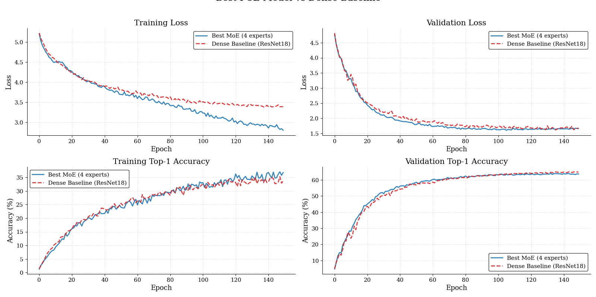
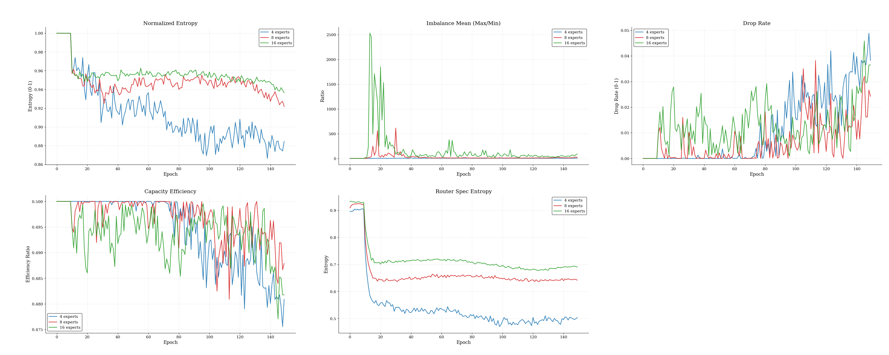
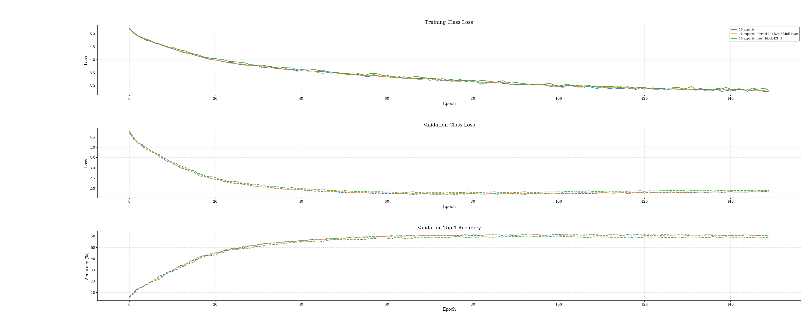

## Abstract 

This project was created to study the training dynamics of a Vision Mixture-of-Experts architecture in a context different from classic Transformer architectures.

Specifically, the project analyzes an MoE embedded in a hierarchical CNN. Unlike Vision Transformers, where tokens can interact globally via attention, a hierarchical CNN operates with a local and progressively downsampled structure. This makes MoE routing on patches an interesting case: the router must specialize the experts using local and positional information, without directly benefiting from a global attention mechanism.

Experiments suggest that, with the current setup, a CNN-based MoE may suffer from a load imbalance assigned to the experts by the router. This imbalance seems correlated with a worsening of generalization, but the cause of overfitting is not completely isolated. Tests show that dense residual blocks also have a strong impact on performance, leaving open the relationship between sparse routing, dense post-processing, imbalance, and overfitting.

## Introduction

In this work, an MoE architecture based on a hierarchical CNN is proposed. The convolutional component resides in the model's backbone, while sparse routing is applied at the patch level on intermediate feature maps.

The model was trained on TinyImageNet, consisting of 200 classes and images resized to 224 × 224. The main contribution of the project is the analysis of routing dynamics. In particular, two aspects are distinguished:

1. **Local router decision**, measured via `spec_entropy`, which indicates how sharp or uniform the probability distribution over the experts is.
2. **Global traffic balancing**, measured via `entropy_norm_mean` and `imbalance_mean`, which describe how the patches are distributed among the experts.

## Method

### Architecture 

**MoE Blocks** The MoE blocks operate at the patch level on the feature map. Each input feature map is divided by the `Patch Extractor` into patches of size $P_s \times P_s$. For each patch, positional features are then calculated via `Fourier Positional Features`, which are concatenated to the patch content and used exclusively by the router.

The router then receives patches enriched with positional information and decides, via Top-1 routing, which expert to assign each patch to. The experts, instead, receive only the original patch content, without positional embeddings. In this way, spatial specialization is delegated to the router: it is the router that, observing both the content and position of the patch in the original feature map, must select the most suitable expert.

After routing, each convolutional expert processes only the patches assigned to it. The experts' outputs are then weighted by the combination coefficient produced by the router and accumulated in the position corresponding to the original patch.

Denoting with $E_{out}$ the aggregated output of the experts and with $X_p$ the original patches input to the block, the first residual is defined as:
$$O = X_p + \gamma E_{out}$$
where $\gamma$ is a learnable parameter initialized to a small value. This residual has two main functions: preserving the original signal during the early stages of training and making the experts' contribution gradual, preventing sparse routing from destabilizing the representation too early.

At this point, the processed patches are recomposed into their original spatial arrangement via `rearrange`:
$$R_{out}(O) \in \mathbb{R}^{B \times C_{out} \times H_{out} \times W_{out}}$$

The reconstructed feature map is then normalized and activated:
$$MoE_{out} = \text{SiLU}(\text{GN}(R_{out}(O)))$$
This step serves to stabilize the feature distribution after sparse processing and before the subsequent dense phase.

The third block is a shared convolutional block:
$$res = \text{Conv}_{3 \times 3} \rightarrow \text{GN} \rightarrow \text{SiLU}$$
Its role is to locally mix the features produced by the experts. This is important because patches are processed separately and then reinserted in their original position: without a local dense operation, discontinuities could emerge between adjacent patches or overly sharp boundaries between regions processed by different experts.

Finally, the layer applies two residual connections:
$$MoE_{out} = MoE_{out} + res$$
$$X_{out} = R_{out}(O) + MoE_{out}$$
The first residual integrates the contribution of the dense convolutional block, while the second maintains a direct connection with the reconstructed feature map after expert processing. In this way, the block combines three components: sparse routing on the experts, shared normalization/activation, and dense convolutional post-processing.

**Router Gate** The `Router Gate` is the module that assigns each patch to one of the available experts. For each patch $X_p$, the gate builds a compact representation using global spatial statistics:
$$R_{in} = [\text{mean}(X_p); \text{amax}(X_p)]$$
where $\text{mean}(X_p)$ and $\text{amax}(X_p)$ are calculated along the spatial dimensions of the patch. In this way, each patch is represented by a vector summarizing both its mean activation and its maximum activation.

This representation is normalized and passed to a linear layer:
$$l = W \cdot \text{LN}(R_{in}) + b$$
where $l \in \mathbb{R}^{N_{exp}}$.
The vector $l$ contains a logit for each expert. The `Router Gate` can therefore be seen as a function that, given the representation of a patch, assigns a score to each expert in the pool.

The logits are then scaled by a temperature $\tau$ and transformed into probabilities via softmax:
$$p_{exp} = \text{softmax}\left(\frac{l}{\tau}\right)$$

The temperature controls how uniform or selective the distribution over the experts is: higher values of $\tau$ produce softer distributions, while lower values make the logits sharper and push the router towards more definitive choices.

Once the distribution over the experts is obtained, a `Top-1` routing is applied: for each patch, the expert with the highest probability is selected.
$$e^* = \arg\max_i \ p_i$$

However, each expert has a maximum capacity, denoted as `capacity`, which limits the number of patches it can process in a single forward pass. The capacity is calculated based on the total number of patches, the number of experts, and the `capacity_factor`:$C_{cap} = \left\lceil \frac{\text{capacity_factor} \cdot N}{N_{exp}} \right\rceil$
where $N$ is the total number of patches/tokens to route. If an expert receives more patches than its capacity, only the patches with the highest routing probability are kept, while the others are dropped from the sparse path.

The dropped patches are not processed by the experts; however, thanks to the residual connection of the MoE block, the original signal of the patch can still be preserved in the layer. The capacity therefore serves to control the computational load of the experts and prevent a single expert from absorbing all the traffic.

 

---

### Training 
The model was trained on TinyImageNet with 224 × 224 images. The following setup was used for all training runs:
| Learning Rate Backbone | Learning Rate Router | Batch Size | Stem Kernel | Stem Out Channels | Optimizer | Weight Decay |
|------------------------|----------------------|------------|-------------|-------------------|-----------|--------------|
| 0.001                  | 0.001                | 128        | 7x7         | 64                | AdamW     | 1e-3         |

In the setup, the Backbone and Router share the optimizer but not the learning rate. The choice of a higher learning rate for the router stems from the fact that it must adapt quickly to the features extracted by the backbone. Since these features are very rich, thanks to the experts' computation and enrichment via residual connections, the risk of setting a low learning rate for the router is that it might fail to adapt quickly. Furthermore, the router is exempt from weight decay.

Both the backbone and router learning rates go through a warmup phase: 
1. **Backbone Warmup**: Occurs during the first training epochs.
2. **Router Warmup**: In the early training epochs, the router assigns patches uniformly to all experts until each one's capacity is filled. During this phase, the router is completely frozen and thus receives no backpropagation; after this phase, the router goes through its warmup phase.

| Tau Init | Tau Final | Aux Loss Weight Init | Aux Loss Final |
|----------|-----------|----------------------|----------------|
| 2.0      | 0.85      | 0.05                 | 5e-4           |

The router is also equipped with additional hyperparameters: Tau serves to regulate the temperature in the logits, and Aux Loss Weight serves to regulate the weight of the load balancing loss. 

$$
\alpha =
\begin{cases}
0 & e < e_{router} \\
\alpha_{peak} \cdot \frac{e - e_{router} + 1}{e_{warmup}} & e_{router} \le e < e_{router} + e_{warmup} \\
\alpha_{peak} & e_{router} + e_{warmup} \le e < e_{decay} \\
\alpha_{final} + (\alpha_{peak} - \alpha_{final}) \cdot \frac{1 + \cos(\pi t)}{2} & e \ge e_{decay}
\end{cases}
$$

In addition to these, there is also noise. The noise injects randomness into the logits to encourage exploration in the router. All these hyperparameters are scheduled during training; the noise reaches 0.0 by the end of training.

**Auxiliary Losses Used**
- Load Balancing Loss: Serves to prevent the router from consistently assigning too many patches to the same experts.
- Z-Loss: Penalizes excessively large routing logits. It serves to stabilize the router by preventing the logits from growing too much and making the softmax excessively sharp.
- Diversity Loss: Serves to reduce redundancy among experts, pushing the router to produce less correlated activation patterns.

## Experiments
The objectives of the experiments conducted are to: 1) Measure the advantage of a ResNet-MoE compared to a Dense CNN 2) Highlight the training dynamics (restricted to my setup) of the router in the context of hierarchical CNNs. For the first point, the final training and inference accuracy of the best MoE setup was measured against the dense setup. For the second point, custom metrics were calculated to explain the router's behavior.

The MoE setups are distinguished by the number of experts available in the pool: 16 Experts, 8 Experts, and 4 Experts.
| Experts | Total Params | Active Params    | 
|---------|--------------|------------------|
|4        | 33.5M        | 6M               |
|8        | 58.8M        | 6M               |
|16       | 109.6M       | 6M               | 

### Router Metrics 

To analyze the behavior of the router, observing only the final accuracy is not enough. In MoE models, in fact, performance also depends on how traffic is distributed among the experts. For this reason, some custom routing metrics are tracked.

| Metric | What it measures | Interpretation |
|--------|------------------|----------------|
| `spec_entropy` | Mean entropy of the softmax distribution produced by the router before the Top-1 choice. | High values indicate more uncertain/uniform decisions; low values indicate sharper and more specialized routing. |
| `entropy_norm_mean` | Normalized entropy of the actual utilization of experts after dispatch. | Values close to 1 indicate that traffic is distributed over many experts; low values indicate a possible collapse onto a few experts. |
| `imbalance_mean` | Ratio between the most used expert and the least used one. | High values indicate that some experts receive many more patches than others. |
| `drop_rate` | Fraction of patches dropped because the selected expert exceeded its capacity. | High values would indicate a bottleneck in capacity. |
| `capacity_ratio` | Fraction of total capacity actually used by the experts. | Helps to understand if experts are working near their maximum capacity or if part of the capacity remains unused. |

In the project, these metrics serve to distinguish between three different phenomena: router collapse, load imbalance, and capacity saturation. The results primarily show an increasing load imbalance as the number of experts increases, while `drop_rate` remains low and `entropy_norm_mean` stays high.

### Results

**Accuracy & Latency**

| Model  | Top-1 Acc ↑ | Val CE ↓ | spec_entropy ↓ |
| ------ | ----------- | -------- | -------------- |
| Dense  | **63.85%** | 1.67     | --             |
| MoE-4  | 63.60%      | **1.66** | 0.50           |
| MoE-8  | 62.06%      | 1.76     | 0.64           |
| MoE-16 | 61.00%      | 1.78     | 0.68           |

 

The MoE model with 4 experts is the one that achieves the best accuracy among the sparse configurations. It is also the model with the lowest `spec_entropy`, therefore the one where the router produces the sharpest decisions. However, it cannot be concluded that better local specialization of the router directly implies better accuracy: all MoE setups still show signs of overfitting. Furthermore, subsequent tests suggest that a significant part of the performance also depends on the dense post-processing after the `rearrange`.

| Model      | Top-1 on inference subset (%) ↑ | Avg Latency (ms) ↓ | Std Latency (ms) ↓ |
| ---------- | ------------------------------- | ------------------ | ------------------ |
| Dense (18) | **67.33**                       | **2.07**           |**0.32**            |
| MoE-4      | 65.35                           | 27.61              | 4.47               |
| MoE-8      | 64.36                           | 35.76              | 4.48               |
| MoE-16     | 64.36                           | 47.57              | 4.33               |

 

**Router Metrics**

| Model  | entr_norm | imbalance | drop_rate | cap_ratio |
| ------ | --------- | --------- | --------- | --------- |
| MoE-4  | 0.88      | 9.76      | 0.03      | 0.48      |
| MoE-8  | 0.92      | 24.19     | 0.02      | 0.48      |
| MoE-16 | 0.93      | 90.18     | 0.03      | 0.48      |

 

The router metrics show that, as the number of experts increases, the router does not completely collapse: `entropy_norm` remains high, indicating that a large portion of the pool continues to be used. However, the `imbalance` grows markedly, going from 9.76 in the MoE-4 model to 90.18 in the MoE-16 model. This suggests that the main problem is not a total collapse of routing, but an increasingly uneven distribution of the load among experts.

**Overfitting**

During training, all MoE setups show signs of overfitting: the training loss continues to decrease, while the validation loss tends to worsen in the final stages. The cause is not completely clear. Overfitting could depend on overly aggressive training, the router's difficulty in maintaining a stable load between experts, or an architectural cause related to the interaction between sparse blocks and dense blocks.

Two main architectural hypotheses were tested.

1. **Artificial Receptive Field**: In the deeper layers, the patches reach sizes of 2 × 2. In this case, experts with 3 × 3 kernels could introduce an artificial receptive field relative to the actual size of the patch. The test was conducted by replacing the 3 × 3 kernels of the last MoE blocks with 1 × 1 kernels. This modification did not reduce overfitting.

2. **Dense Post-Processing**: The second hypothesis concerns the role of dense blocks after the sparse compute. An overly expressive dense post-processing could absorb part of the experts' capacity and become the main driver of backpropagation. The test was conducted by replacing the 3 × 3 kernel of the post-block after the `rearrange` with a 1 × 1 kernel. This modification also did not eliminate overfitting, but it showed that the dense block is important for performance, given that reducing it worsens the Top-1 accuracy.

## Conclusion
A critical observation concerns the trend of the validation loss, which tends to diverge in the final phases of training despite a decreasing training loss. This overfitting, which is more pronounced as the number of experts increases, led us to formulate two architectural hypotheses.

The hierarchical MoE architecture on TinyImageNet demonstrates that a greater capacity for sparsity does not automatically translate into better generalization. The best regime is the one with 4 experts; wider configurations suffer from a load imbalance that the auxiliary loss function fails to compensate for. The observed overfitting does not seem to depend exclusively on local kernel sizes or exclusively on the presence of dense post-processing, but appears primarily linked to the difficulty of stably optimizing the allocation of traffic among the experts.

All results can be reproduced by downloading the entire project repository and running the experimental script main_experiments.py, which calls the functions for log analysis and model comparison. In the uploaded materials, this file is present as a dedicated script for the final experiments.